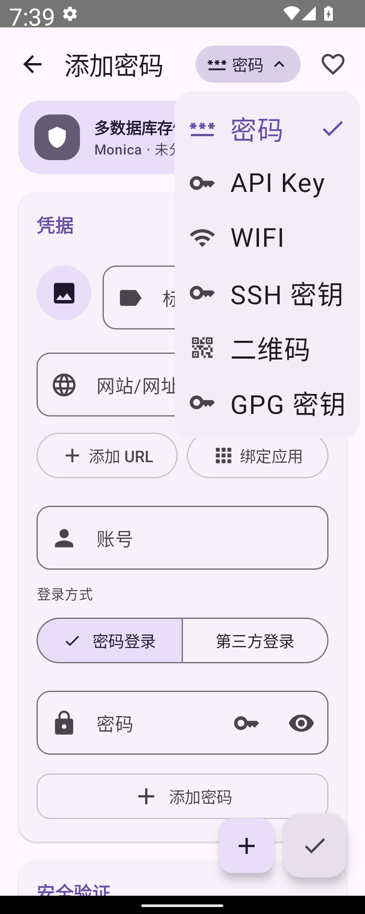
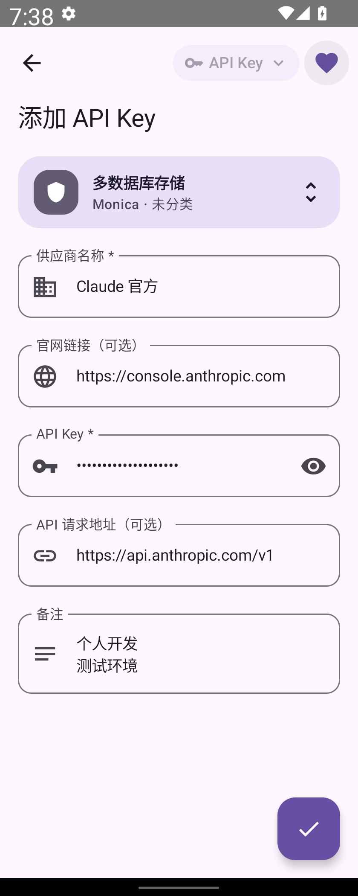
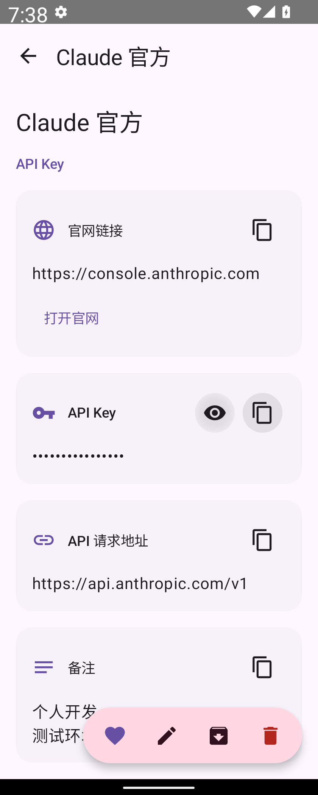
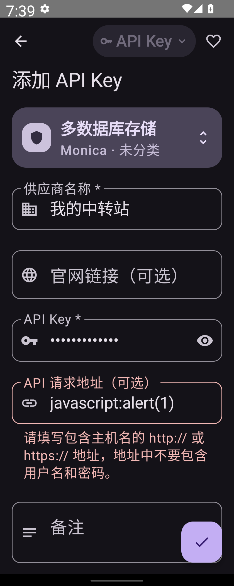

# AI API Key

[打开可编辑 M3E Canvas 草图](https://lnkiai.github.io/m3e-canvas/#docz=3ZpbT9tIFIDf-ysiHitoyYUQ-tbuqt2qqlRpV9qVVhWaJBMywthe2wmwFRKwhXIL6QVaLqEtCLpsL0C1vaQJUGl_ytZjJ0_8hZ3xOBDn4hDHrNRKFbVnxnNmvnPmnDMzuXPO42lTkMLBtkuetpsCjyLA889Hz-Xrnsu3rntuwOG2dtokLCEYo03U_DzendSfjxXX32uP9_DG01LDo_059fMafrNEP9YyKTyzrh6u4twCXpz8MjqGd5b0gwf0YXey-HCLPNDvCrsftbfjOLOH10bV7DzevKf9vU160hZ2tbkxfX5Py0wzeaRjPL6tHqT0g50vo-NsWDEJDBgjF-MCD1mZyAElJkgDtBjwUUlAUbMCcFBRIJ0T_SIhiZz5iRKHRjd3yAt5jQKpn7zFACfDdlYUFpT4TSEKZVKuSIlSsRwHoiFfEhJ8FDJBdFwCr9BieVhW4ECpNEJKJSCzGoWMDUjHXwwIChJ4WgOHRAnKMkrCNlI1cjJPKvtXozUbJyknUyNfKMMiqWwvFfImk-LotDb7F1VSPqe_zeOnsydthkiDzuO3YcsbLyjG9xY953OF9W2cWtRX7rK-CukMecUzz_HEVpkJaE82iMpYE2IORIk4vVs4PKQqMwSMtNeaAowiRZCq58BEW2zxePyBHl-DGRzbH76f0v_cUw8yajanra3rqzva83vFjaWj_VVml2SQBBd9NayzmF8q7GwWV-4XnqRJIbPGwr2XeGdF_TTtqbRcMu_i6Di-P0U60x5_YsaPH87RL_I5Yupq9k3h4DUrb0AiChWAuGoSJgIi94X2x4SVRE8o0EiX6V3t2ZaemSWD0fcfFw4fkOHhzRSe-kAGzyatHnzWF7a1xbR29xmefll4905b-0xmX5KsZlOMIOGlv1rWl_P4YJEZiZa-T1jT6c5s4_VXeGLiZJbk723DiPvIIhHtjbgjDKTTGSkYQrQr0ua4CJGldtJ9uYhaYjrQyco0W_QjnrURxMuieKVsKEY1B8KQM4zyY57avTFzaxMUYWsYSJIw2BsGkX5rfRJICDDXEEMcRxzGce2I-XTbxjbo4DsicSRaGfm6rZS8nV2ucDJE2XCyjMSKyA4OcXDE9_UOCBJsRMdSHYnDSD-Mmh64eXCdVmreoBVa0OcOtE4bYhySletVtaeiJgJZHhSkaFPIQMSMKuWDpQFPqI4bpSoJ8DIqBSOehtWyBiPNY_faYvf5Q-5g9zrHXhldLNyTIt_bX1nZEvaKWFeTu8yhaKvgfbbg_d6AO-B9zsH_jDquotrYB1EMfXWm7rcn3uNO-OrwOyf-448_eFi0r43dXUv_f6gHbKkHgkF3qAecU6cpZz2__pvUGyEbi17fV8e9y5Z7V8CleNrVmmP_SeiH_Ldj7EFb6EGvS9E06Bz6tVvXviUXw6J19cak_u7TKfgTSS3vTTy2Kc3pdydVn_uMSpAUJDLE3jDJR6FUS11ytb5M6dbSCj1a6kZa1Rnt06q07qBVaT1Bt7RmrBpHWyVbVbmzV2p6PbVMHkh9ULGy7-oMWTdcgYBr8A1xzl0WO7dkZ4u19RAFCggDuTklyAlRFCQF8X3Gysy8pqdF7DAz96jO2gLRik6OT3A2U_rCtnkiurnCBsuO-PDy9tH-Cuv_y-jYze-v_EL-uwHhLbJnJE9XkDIIyErljw9lmlSnKAlJVL7SayrU5_e5pdCSQDtHCIeUqwhy0Xo6tZ79ec7XVmw4ISMeynJdxQoJhSMtbFWrHs7iF-NEB99xIBGFHnYMSMhrUw_0lbvs9E9_tewI_iAMk1gG7dn7fa7FH1NeC-jZkWrx0aE2v3W0P1U6W52urQEO8H0J0Adb0kBcUUT50sWLcAgMiBy8EBEGHMGWYURq5LgCnSG3WDNxLaAunc2ebz7XOg3Wf0c3mvpX23VZT9Pn9My-vraqzU0XH-6o2Xfakw_a0qG-mTvaX1WzKW1mhmWPeHIZT2wV198X1zb0mQ8aWU1jG8QLaot7WmrHqSuDfFQUEN9Ixe4lBiWBLSrZet3QcE0hvt-V9QREdKFsTV1Meh1Rp5Yg2yPvCrmWDhjSWvFfxi1kbbLWmbQULNTsSzWXw_ujOG3ci068xumsmn1Ewrwz3wWSFVEi5Lemu90h16IEFWaDOAbCdeDWxmrkqy5uC81bNMd5LPu-etdX_6bNKc8TSS3s-s50u0c1fmZ7vPbqDnz1ezCPzl3aJpro2c8frMcqnZ0VV2pe1zRtiGvgneqo2ZJe1lQ2n-C4prYo6Hcaon1BS2lY4Bxds5kzjFHfWnXdVoW0O-QWUlNgCxdvZRmrwyy18QawFFMjhhYvAFRnvdGfiUBe6Y0I4nCbc_7eBvzLb41d4X9WN3DNHhi6mcK6rRRfA6X4XbiFtgpsTSnlaaeDVPP0i4ImmuSjuCSIKGJs385UD_4Gegh0BdzVQwt3ds7T0cb4y3PQsyIux4XBBri7ul3DTaXZsA4nFEXg6x2eG_tQu8uLJJJRGHFIqe-SSPeAqxllvSGfE34GeCs_b0_orPhRaU75sR-U2fGzGJODRMUGIf2d2bmRc_8B)

从密码页新建菜单选择 API Key，表单包括供应商名称、官网链接、密钥、API 请求地址和备注。复用密码的加密保存、多位置选择和详情操作，默认隐藏密钥。

草图和原生渲染验证见本目录的 ai-api-key 图片及 docs/testing/ai-api-key.md。

## 原生渲染

主版已完成实际点击、读写和显示验证；记录见 [API Key 验证说明](../testing/ai-api-key.md)。
