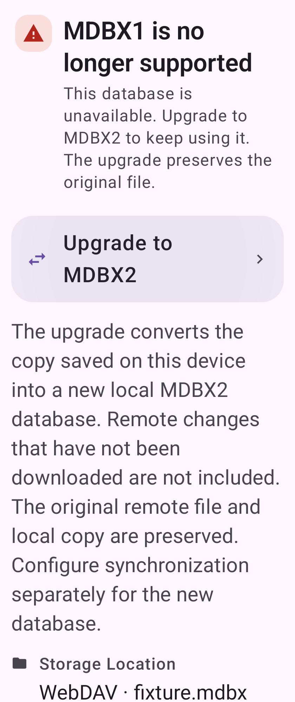

# Monica · MDBX1 停用与升级

[打开可编辑 M3E Canvas 草图](https://lnkiai.github.io/m3e-canvas/#docz=7VvvT9tIGv7evyLK51YiJvy6b9ddrXS667c76aTTqjKJAavGtmyn0FshkV4J9EgC2raUH6latqFBtCTZLtummIB0_8p67ORT_4V9x-M4sePE4DgLH-5LRWbG88487zPPvDPz9odbkUhUYRWOif4pEr0n8GyCjvzvc-Tet3f_GYugdMF4fqjV8ii3apyWordx62mJZWZwa-3ilfFiR39ZQqfPGuUqqr9AP2b1rVVN_fT1bE_fqiL1VFNX9OcVPZs2e6R-W35M2mtqXqvl0EYF-jfephsnJ42LPbRyYKx_MN6vE3P6r2njcP3rWRaVs_rapv6iqufK-pv95lEWbebR-Uu0VgUrxu4TvfABFaq2CTLOGYmeN2clzgk8Q8pEjlZmBGkeF9N8UhLYpFVBc4yiMH9lHplfpCSRsz5R5hizmx_gB_xM0tID-DVDczJzmxRNC8rcPSHJyFCuSKlWcULgFYmWFdyhrIA1WiLGoE6eo0VzbJKQ4pOMXT4D35jtH8kKM98qnRcUVuBxObMoSowssw-ZKFQtteeJbf_LbE3GCeUwNfhinubpWUayuoJi3kKFwAmuMMr7xmam3WARakfsX48cv3hBIR9_vADHmYBHyPfN_V_BEeCaRiWNdiyfYuZ8foc2fonEqKQYAbYYO3XMAZMbmC1Pn6GzZVRaN9Q1IEPj_JwwxHi6ZvWgmiR5_AWtqpp6oL8-MArrjcqJvp2HzwlPgCFaPYPplMnpF8v6ifrbchptZvXjA31tS6sXtNopyuwAu7R6zqiXMUPMCS3d9kKMY2bpxKNuwMiSsFnrBCw-RflAhoo5-KpRPocRAFjov4cwMkN98vVsFxW3tPMSKpZQIdMo_QijN_Zqzccqqm60Sh6TqcIc0MZbY-9Ezx9gvEppqOpch_ovhyiT1S729XQFA5R_3VqQWVjM-vFP-k65ubzbqKiACBhqqtuNctHYg3W1Cu0bq0cwMIKdD0wpcVaik0w3TmSkzZ-e6G-XnSBNTcYvBZKRr-qFp42LtFFSST9AJKwPp-8wEmt7QB4iFJ0LH6ZIxEF_tQ8TgsmRqaPiF5hZc-cJ_ht0wxQTEChU_LlxcqDXVoC9BABMJILlqwP9dBNsNS4KxvuKBe123tgvW9wjAlX4oBdO0dMK_IGtF4602nqjXseKBC56_gWTJbuCNt_jYYN7j19q9WcwF_3wCP28AQ7U1V3AG3_7LAd0sJeABTz8-725xmdBJ0S_NX5nmpYut4zpRRZ3Bm3sIhb0pm2g04i3oTtsW6CsNg9Y3mylCOKfRfFux2DMao6eZjhTPEyn2frjbMUmiNLRkiQs3J-mEw-c9Q9piaWJSM6wHAfSadcuWX9934e1rRkIIsM7sYo5F3BsZDI0uLCxPnhNpxRF4HuBZSqkD1gzApdkpPuOSbnRAhM0FwwsnllwYkV1gBM2WGAsMFbmtkLUoAerkslQ6aSwHHNnpD-RpgZfd8RMP1iExR6YeOLApzjOBwZHtcz-G8tzbHKyq5gyy0cc5bgLM4pJSTN0gvkGghqa5Rnpb8KCs1_YQNiU_HdBxJyKe1TdFcDd8921dMKKiPBMAnjsjgmEk9PjDrdRI-OhuQ1s9fEdrr7bj9beVE7SCj1Ny0zvBc8sKtFwUcNduunuxm1iMizciLV-G03XDG3MtNqRdnraXzaDroKxwNDF-kI3Gh7liLVg0Jnyic-AZJ92RbvXBKAbuWGJbOz_ItstF51g4ROx4HFMatVJNC-zreOqzLFJJtrRYimA5720elhiHRuSWC_QEs_ys0G0-prB95T8YWl-bCDNJ_cGN0bzY96aPyzRjw0s-jEs-t33G388fPZRAN8K9Iut4yNUeOcOMBYK7wA-cj2g1fqdRYJCOXElKIlQdN8M9L6vCopj29IgVwOXWMJXuBrwUFS5W1Ktfp2lttS6L1Avq7adentV7bWwTLRvjC23jY3EQz94dxi79uBntEfwQ8Xjww9-grjIvbETL1HOi7cYFdrysuxdU4QSBCHzcckdQXQh1HEzPCBClr1BtkH0-aN1WW4-XYVJ8GAsYxZFDmQIa40fkhQVmiI4rAbcGo-L7X3x80c7uGg90oW1KY4PimrMB9Wx8WGgGjBYc4UXEbSZN9SSoR5rdfws9_Vs72aBS_mAG97id1gdCNyzXfIUZL-g3QjKdj26eQUFoxOhkdWy1wdJjpWVv3TV9qKq997jntVlYMTf4sggmphjHkoCf19iZ-dcPpVToihICt7W8FDMd0P05RN5JSQPiPipbqvXW1SPoKT_0dxrMt7R4j_E6KARIickTLL3J0R8ggqLEC2DAzCitaDIY3y_B60rEcLpbLJ4yUOy7V1it5ePg-CfZDhG8VmOYxOhyRsxNwD2a2-aO0Wf45VrTlfHniSHEOyJRfxuXi6SfJ5Q4G_pUte5tneKQVDoO0wNcLC9lA4mOEFm_ogzref1obdIfSss8GEda1tQJhk5IbGiVzg7NTUe-gHX02yw4MB4_hpnonUlnUXsNXW9YYLXVGM-CI-ODwXhoLEtbA8tLEHE4fhlHhq27TRACHatNB-z2c3AOyGkeMUH58nwmGyaC74NEORcGVrO_ReE5T5EVle8YnPtA73zsHAK2sVqO5czkyPODXVzMBPS-vokjJNHpzUfyn_HMlyyd-5K-6S8mTNK1SvTWkgpHMv7-MR5wWrtRoHgFWlZXhDcN5RuiEdDpH3LYkgwazUVVTLGG-8LniiEur3Zb2MdCDqJmcevDT57X3wqPGVuWQwmyp1pkDhftSP7ETQaHW_DdkjSIMOW47FB8PXZ-caoeNj4Bt30qrudyaMW3HYKaeGQIN7I_gftnaDMyo1CmfJBeYwKG-WANzuda79ZWG68S6PcC2P9Q3MFH0TbSc_Xj6ys0JJPODFOhScOprmgSZckf7_jP4gEvd4JFnjRfALG4Xokdl0whokVMRgYrI0t_dPalRk2tPQQ9-mu53kOZ6LfWrr1Ow)

沿用 MDBX 管理页：左右 12dp 留白、验证器磁贴、设置页动作组。新建仅支持 MDBX2；旧版保留记录并显示不可用，点击进入说明与升级。

升级生成独立本地 MDBX2 并校验条目、文件夹、附件，保留 MDBX1 原文件。远端来源仅转换本机副本，界面明确提示范围；无法读取本机副本时应给出错误。实际迁移表单复用现有预检、进度与校验结果。

Native rendering was checked on the shared API32 AVD at 840 × 2100, density 420 and font scale 1.5. The upgrade action is visible and long text wraps. F-Droid rendering remains unverified at the user's request.

